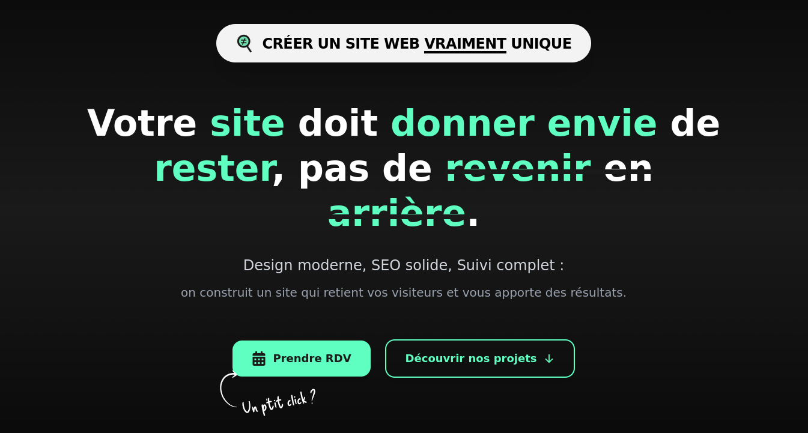
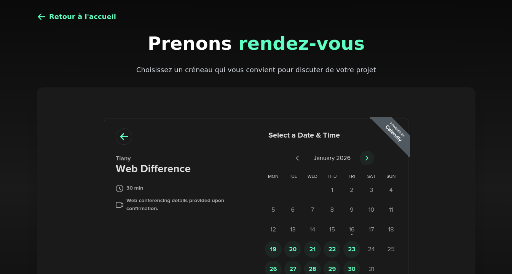
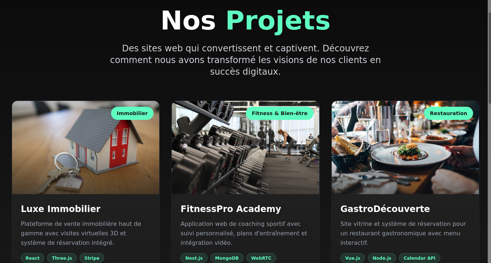

# Test Technique – Intégration Frontend
**TARAM Group**

## Démo & Code source

- **Démo en ligne (Netlify)** : https://web-difference.netlify.app


## Présentation du projet

Ce projet a été réalisé dans le cadre d’un test technique frontend pour TARAM Group.  
L’objectif principal était d’intégrer une **hero section en respectant strictement la maquette fournie**, tout en démontrant rapidité d’exécution, capacité d’adaptation et qualité du rendu.

Au-delà des exigences initiales, plusieurs améliorations ont été ajoutées afin d’enrichir l’expérience utilisateur, tout en respectant l’ADN graphique et fonctionnel du projet.


## Aperçu






## Technologies utilisées

- **React** – Architecture orientée components pour une meilleure lisibilité
- **Vite** – Environnement de développement rapide et performant
- **Tailwind CSS** – Intégration pixel-perfect et responsive sans CSS superflu
- **React Icons** – Icônes vectorielles légères et cohérentes
- **Calendly (Embed)** – Prise de rendez-vous intégrée directement dans le site en respectant l'ADN du site
- **Netlify** – Déploiement continu et accès immédiat au projet
- **Git / GitHub** – Versioning propre avec commits structurés


## Fonctionnalités

### Exigences principales
- Intégration fidèle à la maquette fournie
- Interface entièrement responsive (mobile et desktop)
- Découpage clair et maintenable des composants React
- Utilisation maîtrisée de Tailwind CSS

### Améliorations apportées
- Animations et transitions subtiles pour améliorer l’expérience utilisateur
- Intégration de Calendly en embedded, sans redirection externe
- Création d’une page dédiée listant des projets réalisés (projets fictifs mais cohérents)
- Déploiement sur Netlify afin de faciliter les tests et la revue
- Attention portée à l’UX et aux bases de l’accessibilité


## Approche technique

- Architecture pensée pour être évolutive et maintenable
- Approche mobile-first
- Animations légères afin de préserver les performances
- Respect strict de la direction artistique tout en ajoutant de la valeur
- Utilisation raisonnée de l’IA comme accélérateur de productivité


## Responsive design

Le projet a été conçu selon une approche mobile-first, avec des ajustements progressifs pour les écrans plus larges afin de garantir une expérience fluide et cohérente sur tous les supports.


## Installation et lancement du projet

### Prérequis
- Node.js (version LTS recommandée)
- npm

### Étapes pour tester le projet en local

1. Cloner le repository
```bash
git clone https://github.com/Heriniavo-Tiany/web-difference.git
```
2. Accéder au dossier du projet
```
cd web-difference
```
3. Installer les dépendances
```
npm install
```
4. Lancer le serveur de développement
```
npm run dev
```
5. Ouvrir le projet dans le navigateur
```
http://localhost:5173
```
# Méthodologie et contraintes

Le projet a été réalisé dans le contexte d’un test chronométré, avec une attention particulière portée à :

- la rapidité d’exécution 
- la précision visuelle 
- la lisibilité du code 
- une approche proche des conditions réelles de production

# Conclusion

Ce projet reflète ma manière de travailler en frontend :
structurée, orientée produit, et attentive aux détails, même dans un contexte de temps limité.

Merci pour votre temps et pour l’attention portée à ce travail.